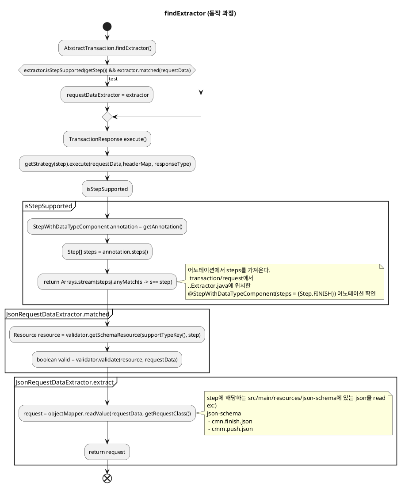

```plantuml
@startuml 
title : findExtractor (동작 과정)
start    
 : AbstractTransaction.findExtractor();
if(extractor.isStepSupported(getStep()) && extractor.matched(requestData)) then (test)
: requestDataExtractor = extractor; 
  endif

: TransactionResponse execute();
: getStrategy(step).execute(requestData,headerMap, responseType);
 
:isStepSupported;

partition "isStepSupported" {
: StepWithDataTypeComponent annotation = getAnnotation(); 
: Step[] steps = annotation.steps();
 : return Arrays.stream(steps).anyMatch(s -> s== step);
note right  
어노테이션에서 steps를 가져온다.
 transaction/request에서 
..Extractor.java에 위치한 
@StepWithDataTypeComponent(steps = {Step.FINISH}) 어노테이션 확인 
end note
 
} 

partition "JsonRequestDataExtractor.matched"{
   :Resource resource = validator.getSchemaResource(supportTypeKey(), step);
   :boolean valid = validator.validate(resource, requestData);
}


partition "JsonRequestDataExtractor.extract"{
   :request = objectMapper.readValue(requestData, getRequestClass());
   note right
    step에 해당하는 src/main/resources/json-schema에 있는 json을 read
    ex:)
    json-schema
     - cmn.finish.json
     - cmm.push.json
   end note
   :return request;

}
                       
end 
@enduml
```