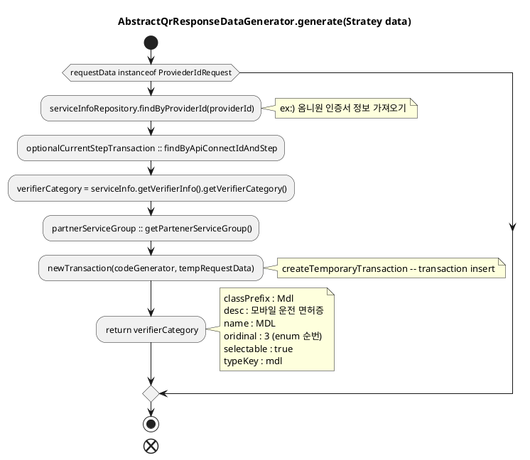

```plantuml
@startuml 
title:AbstractQrResponseDataGenerator.generate(Stratey data)
start   

if(requestData instanceof ProviederIdRequest)  
  : serviceInfoRepository.findByProviderId(providerId); 
note right
  ex:) 옴니원 인증서 정보 가져오기
end note 

  : optionalCurrentStepTransaction :: findByApiConnectIdAndStep;
  : verifierCategory = serviceInfo.getVerifierInfo().getVerifierCategory();
  : partnerServiceGroup :: getPartenerServiceGroup();
  : newTransaction(codeGenerator, tempRequestData) ; 

  note right
  createTemporaryTransaction -- transaction insert
  end note 
  : return verifierCategory;  
note right
  classPrefix : Mdl
  desc : 모바일 운전 면허증
  name : MDL
  oridinal : 3 (enum 순번)
  selectable : true
  typeKey : mdl
end note 
  endif
  stop 
end 
@enduml
```