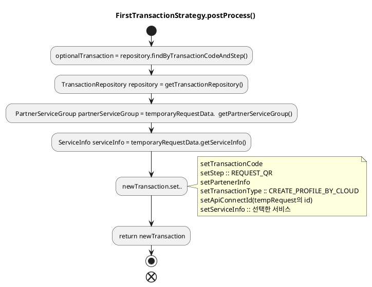

```plantuml
@startuml 
title:FirstTransactionStrategy.postProcess()
start    
:optionalTransaction = repository.findByTransactionCodeAndStep(); 

  : TransactionRepository repository = getTransactionRepository();
  :   PartnerServiceGroup partnerServiceGroup = temporaryRequestData.  getPartnerServiceGroup();
  : ServiceInfo serviceInfo = temporaryRequestData.getServiceInfo();
  : newTransaction.set..;
   note right
    setTransactionCode
    setStep :: REQUEST_QR
    setPartenerInfo
    setTransactionType :: CREATE_PROFILE_BY_CLOUD
    setApiConnectId(tempRequest의 id)
    setServiceInfo :: 선택한 서비스 
   end note  
  : return newTransaction;   
  stop
    
end 
@enduml
```