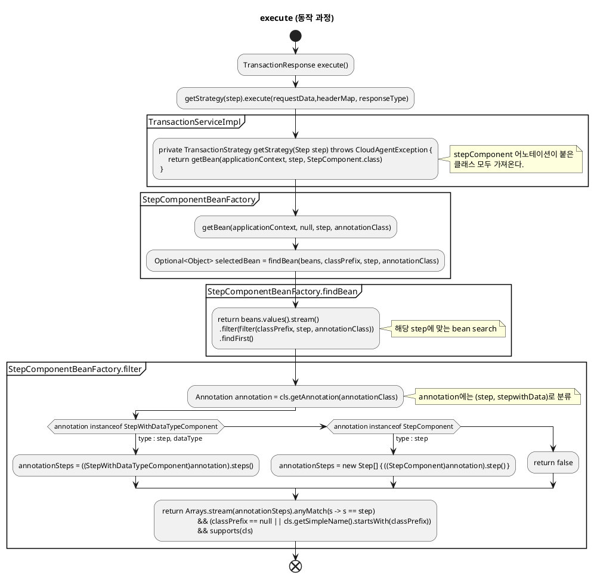

```plantuml
@startuml 
title : execute (동작 과정)
start    
 
 :TransactionResponse execute();
: getStrategy(step).execute(requestData,headerMap, responseType);
 
  partition "TransactionServiceImpl" {
   :private TransactionStrategy getStrategy(Step step) throws CloudAgentException {
        return getBean(applicationContext, step, StepComponent.class)
    };
   }
   
  note right 
    stepComponent 어노테이션이 붙은
    클래스 모두 가져온다.
  end note 
    partition "StepComponentBeanFactory" {
   : getBean(applicationContext, null, step, annotationClass);
   : Optional<Object> selectedBean = findBean(beans, classPrefix, step, annotationClass);
   }  

   partition "StepComponentBeanFactory.findBean" {
    :return beans.values().stream()
     .filter(filter(classPrefix, step, annotationClass))
     .findFirst();

  note right 
    해당 step에 맞는 bean search
  end note 
   }

   partition "StepComponentBeanFactory.filter" {
    : Annotation annotation = cls.getAnnotation(annotationClass); 

  note right 
    annotation에는 (step, stepwithData)로 분류
  end note 

  if(annotation instanceof StepWithDataTypeComponent) then (type : step, dataType)
    :annotationSteps = ((StepWithDataTypeComponent)annotation).steps();
  elseif (annotation instanceof StepComponent) then (type : step)
   : annotationSteps = new Step[] { ((StepComponent)annotation).step() }; 
  else 
   :return false; 
  endif

: return Arrays.stream(annotationSteps).anyMatch(s -> s == step)
                    && (classPrefix == null || cls.getSimpleName().startsWith(classPrefix))
                    && supports(cls);
                       } 
                       
end 
@enduml
```