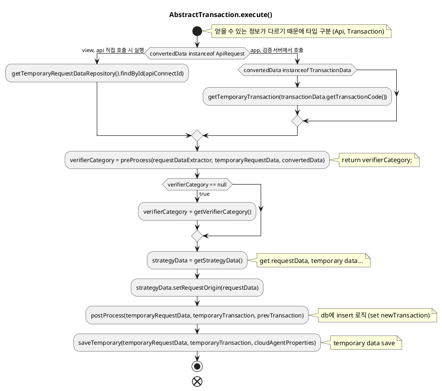

```plantuml
@startuml 

title:AbstractTransaction.execute()
start  


note right
얻을 수 있는 정보가 다르기 때문에 타입 구분 (Api, Transaction)
end note 
if(convertedData instanceof ApiRequest) then (view, api 직접 호출 시 실행)
  : getTemporaryRequestDataRepository().findById(apiConnectId); 
else (app, 검증서버에서 호출)
      if(convertedData instanceof TransactionData)  
    :getTemporaryTransaction(transactionData.getTransactionCode()); 
 endif
 endif

:verifierCategory = preProcess(requestDataExtractor, temporaryRequestData, convertedData);
 note right
return verifierCategory;
end note 
 if(verifierCategory == null) then (true)
 :verifierCategory = getVerifierCategory();
endif

:strategyData = getStrategyData();
note right
get requestData, temporary data...
end note 
:strategyData.setRequestOrigin(requestData);
:postProcess(temporaryRequestData, temporaryTransaction, prevTransaction);
note right
db에 insert 로직 (set newTransaction)
end note 
:saveTemporary(temporaryRequestData, temporaryTransaction, cloudAgentProperties);
note right
temporary data save
 end note 

  stop
   
end 
@enduml
```